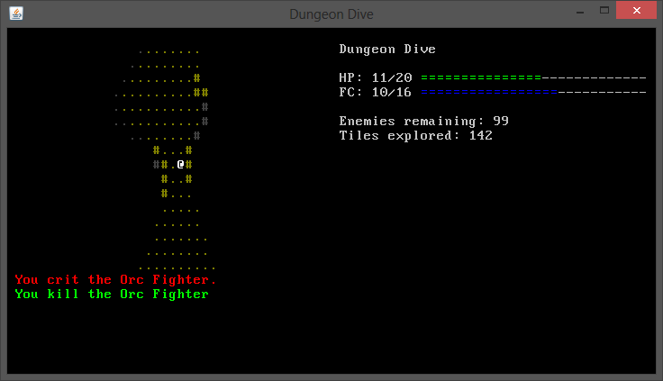
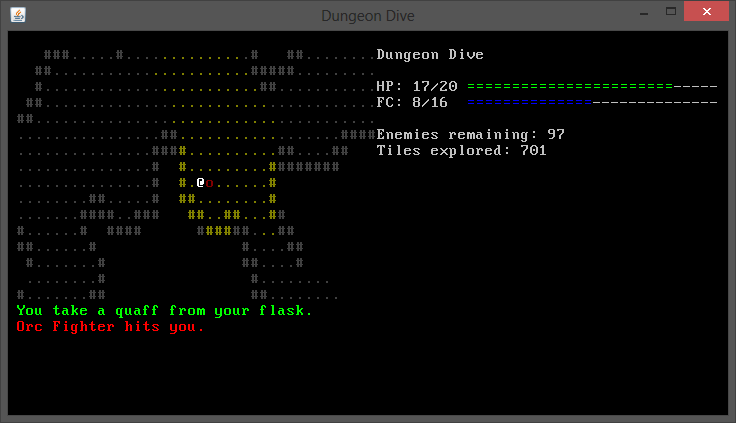

DungeonDive
===========

A coffee break roguelike for this year's (2014) 7DRL.

Walk into enemies to hit them; try not to die.

===========

Use q to drink from flask, healing at the cost of flask charges.

===========

Officially started at 10pm on the 9th of March.

\*clears throat\*

A simple classic ascii (cp437) coffeebreak roguelike. Run around the caves and kill orcs!

I originally planned to copy paste no code, but now I've decided to copy paste a minimum of code (things like FOV, which are really repetitive and don't take much thought). I rewrote the cave generation before deciding to borrow unimportant stuff, and it turned out to be a mirror image of my other projects, which is the reason for my change of heart.

This game is really bad because I had a tabletop party, a camping trip, a calculus test, and an english project all in this week. Well, I did only spend the one week on it...

Thanks to:

* Trystan for an awesome library and set of tutorials.
* Trog for supporting my first TrBe that got me into this genre.
* Dr. Diament for lecture time to work on this.
